# Symphony AI 推薦系統實現文件

## 概述

本文件描述了 Symphony AI 睡眠音樂推薦系統的實際實現架構與功能。系統採用 LangGraph 多代理工作流程，結合大型語言模型、MusicGen 音樂生成技術和 CLAP 向量相似度搜尋，為用戶提供個性化的睡眠音樂推薦。系統已實現完整的 A/B 測試實驗流程，用於驗證推薦系統的有效性。

## 系統目標

### 已實現的主要目標
- **個性化推薦**: ✅ 基於用戶生理心理狀態提供客製化音樂推薦
- **智能音樂生成**: ✅ 利用 MusicGen 技術動態生成符合需求的參考音樂
- **科學驗證**: ✅ 通過完整的 A/B 測試實驗設計驗證推薦系統效果
- **用戶體驗優化**: ✅ 提供直觀易用的多步驟表單和音樂播放界面

### 已達成的技術目標
- **推薦準確性**: ✅ 實現基於 CLAP 向量嵌入的高品質音樂語義匹配
- **系統響應性**: ✅ 保持良好的用戶互動體驗，支援音樂播放控制
- **實驗可重複性**: ✅ 建立標準化的 A/B 測試評估流程
- **數據收集完整性**: ✅ 全面記錄用戶行為、偏好數據和實驗結果

## 實際系統架構

### 已實現的整體流程圖

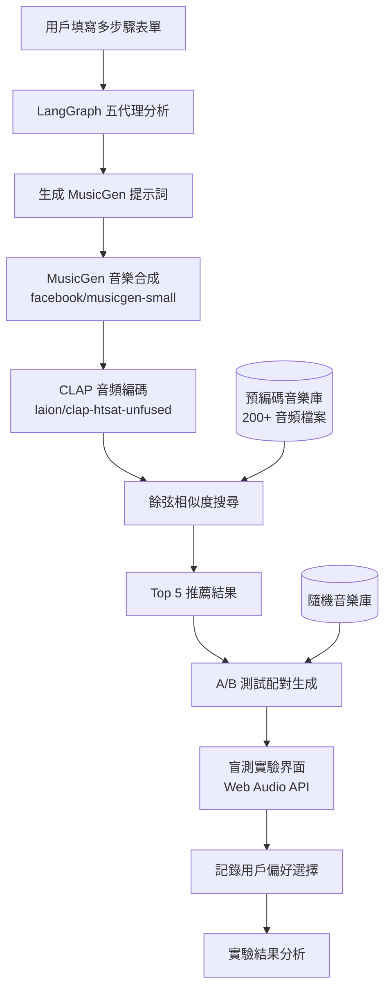

### 實際系統組件架構

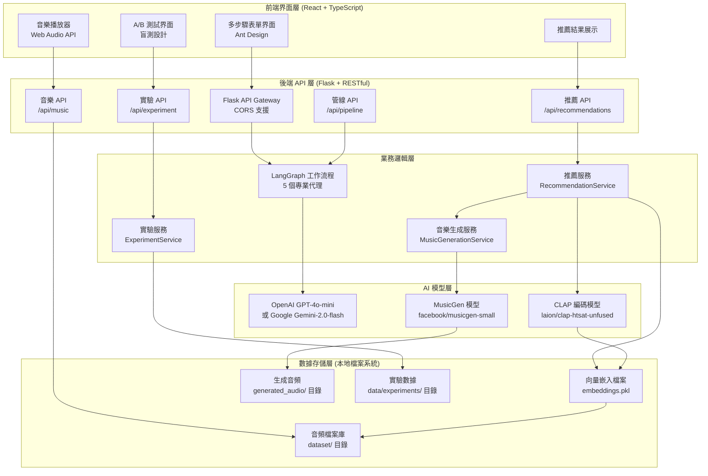

## 已實現的推薦系統核心組件

### 1. LangGraph 多代理工作流程 (已實現)

#### 1.1 實際代理架構

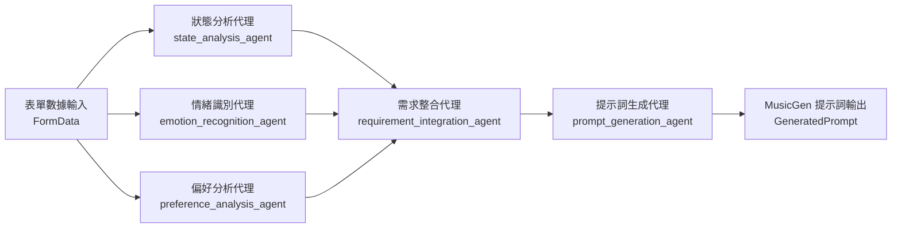

#### 1.2 實際代理實現與職責

**狀態分析代理 (State Analysis Agent)** - `src/nodes/state_analysis.py`
- **輸入數據**: 壓力指數 (stress_level)、身體症狀 (physical_symptoms)、情緒狀態 (emotional_state)
- **分析功能**: 使用 LLM 評估用戶當前生理心理狀態
- **輸出結果**: StateAnalysis 物件，包含狀態摘要和緊急程度評估
- **實現**: 使用 OpenAI GPT-4o-mini 或 Google Gemini-2.0-flash

**情緒識別代理 (Emotion Recognition Agent)** - `src/nodes/emotion_recognition.py`
- **輸入數據**: 情緒狀態 (emotional_state)、入睡目標 (sleep_goal)
- **分析功能**: 識別主導情緒和情緒調節需求
- **輸出結果**: EmotionAnalysis 物件，包含情緒標籤和調節策略
- **實現**: 結構化 LLM 提示詞分析情緒模式

**偏好分析代理 (Preference Analysis Agent)** - `src/nodes/preference_analysis.py`
- **輸入數據**: 聲音偏好 (sound_preferences)、節奏偏好 (rhythm_preference)、敏感度設定 (sound_sensitivities)
- **分析功能**: 分析用戶音樂偏好和限制條件
- **輸出結果**: PreferenceAnalysis 物件，包含偏好矩陣和禁忌列表
- **實現**: 智能解析用戶偏好選項並生成音樂特徵描述

**需求整合代理 (Requirement Integration Agent)** - `src/nodes/requirement_integration.py`
- **輸入數據**: 各代理的分析結果 (StateAnalysis, EmotionAnalysis, PreferenceAnalysis)
- **整合功能**: 統合所有需求，解決衝突，考慮個人化選項
- **輸出結果**: IntegratedRequirements 物件，統一的需求規格
- **實現**: 智能衝突解決和需求優先級排序

**提示詞生成代理 (Prompt Generation Agent)** - `src/nodes/prompt_generation.py`
- **輸入數據**: 整合需求規格 (IntegratedRequirements)
- **生成功能**: 產生結構化的 MusicGen 提示詞
- **輸出結果**: GeneratedPrompt 物件，包含最佳化的音樂生成指令
- **實現**: 專業音樂術語生成，適配 MusicGen 模型要求

### 2. MusicGen 音樂合成模組 (已實現)

#### 2.1 實際實現規格 - `src/service/music_generation.py`

**使用模型**: `facebook/musicgen-small`
**實現方式**: Transformers Pipeline (`text-to-audio`)
**音頻長度限制**: 最大 15 秒 (防止記憶體問題)
**設備支援**: CUDA GPU 或 CPU 自動偵測

**實際提示詞結構組件**
- **音樂類型** (Genre): ambient, lo-fi, classical, electronic, peaceful
- **節奏速度** (Tempo): very slow, slow, moderate, rhythmless
- **情緒氛圍** (Mood): calming, soothing, peaceful, relaxing, meditative
- **樂器選擇** (Instruments): piano, guitar, strings, synthesizer, flute, bells
- **音樂特徵** (Characteristics): soft, gentle, melodic, harmonic, ethereal
- **頻率調諧** (Frequency): 432Hz (當用戶選擇時)
- **音樂長度** (Duration): 固定 15 秒 (技術限制)

#### 2.2 實際提示詞生成流程

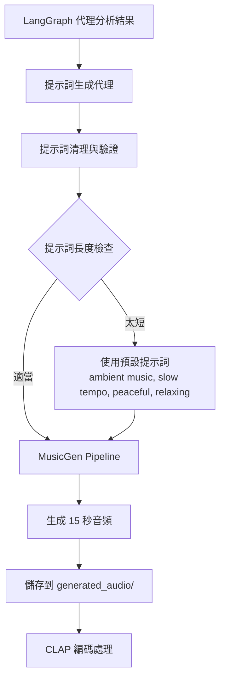

#### 2.3 實際音樂生成服務特性

**錯誤處理**: 完整的異常處理，避免系統崩潰
**提示詞清理**: 自動移除無效字符，確保 MusicGen 相容性
**檔案管理**: 自動生成唯一檔名，避免衝突
**記憶體管理**: 限制音頻長度，防止 GPU 記憶體溢出

### 3. CLAP 音頻編碼與向量搜尋 (已實現)

#### 3.1 實際音頻處理流程 - `src/utils/vector_search.py`

**使用模型**: `laion/clap-htsat-unfused`
**向量維度**: 512 維度嵌入向量
**音頻格式支援**: WAV, MP3, M4A 等多種格式
**資料庫**: 本地 pickle 檔案 (`data/embeddings.pkl`)

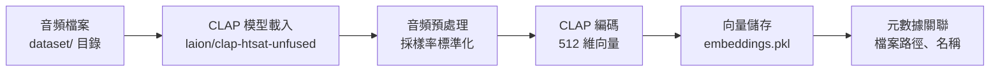

#### 3.2 實際相似度搜尋實現

**搜尋算法**: 餘弦相似度 (Cosine Similarity)
**搜尋庫**: scikit-learn cosine_similarity
**資料庫大小**: 200+ 預編碼音頻檔案
**搜尋效能**: 即時搜尋，毫秒級響應

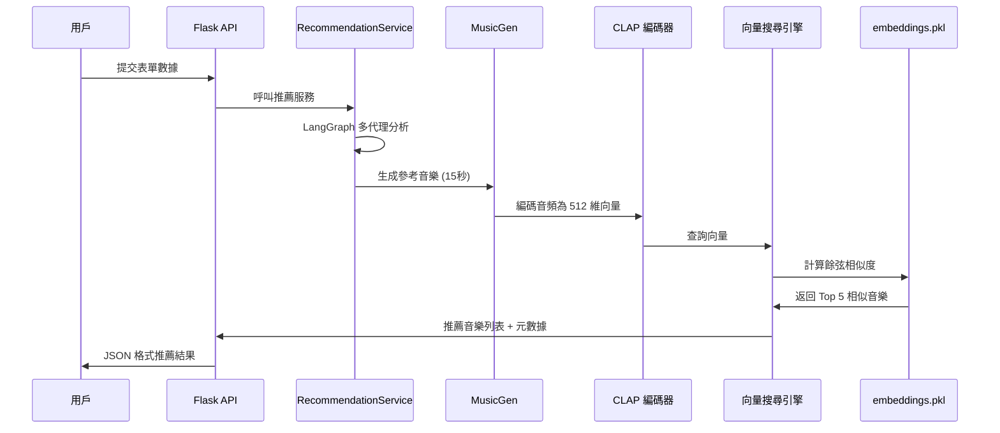

#### 3.3 實際資料庫結構

**音頻檔案庫**: `backend/dataset/` (200+ 檔案)
- 包含多種睡眠音樂類型：搖籃曲、自然聲音、環境音樂
- 支援多種音頻格式：WAV, MP3, M4A
- 檔案命名包含描述性資訊

**向量資料庫**: `backend/data/embeddings.pkl`
- 結構：`{file_id: numpy_array_512d}`
- 元數據：檔案路徑、名稱、藝術家資訊
- 自動更新機制：新增檔案時重新編碼

### 4. 推薦引擎邏輯 (已實現)

#### 4.1 實際推薦策略 - `src/service/recommendation_service.py`

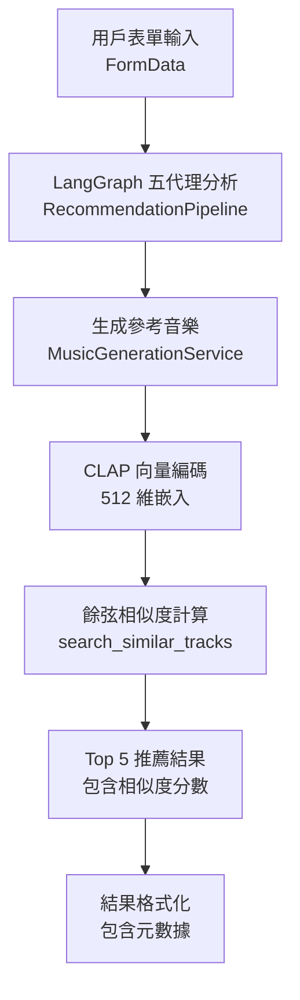

#### 4.2 實際排序算法

**主要排序依據**: 餘弦相似度分數 (0.0 - 1.0)
**結果格式**:
```json
{
  "track_id": "unique_file_id",
  "title": "音樂標題",
  "artist": "藝術家",
  "file_path": "相對檔案路徑",
  "similarity_score": 0.85,
  "metadata": {
    "file_name": "原始檔名",
    "duration": "音頻長度"
  }
}
```

**品質保證機制**:
- 自動過濾損壞的音頻檔案
- 確保推薦結果的多樣性
- 錯誤處理：無結果時返回預設推薦

## A/B 測試實驗設計 (已完整實現)

### 實際實驗流程架構

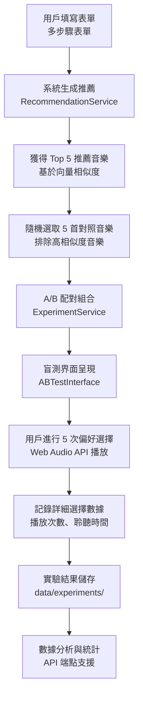

### 實際實驗設計實現

#### 1. 數據收集階段 (已實現)

**實際表單數據收集** - `frontend/src/types/form.ts`
- **用戶識別**: 電子郵件地址 (必填)
- **生理狀態**: 壓力指數、身體症狀
- **心理狀態**: 情緒狀態、入睡目標
- **音樂偏好**: 聲音類型、節奏偏好、敏感度設定
- **個人化選項**: 播放模式、引導語音、睡眠主題

**表單實現特性**:
- 多步驟界面設計 (5 個步驟)
- 即時驗證和狀態保存
- Ant Design 組件庫
- TypeScript 類型安全

#### 2. 推薦生成階段 (已實現)

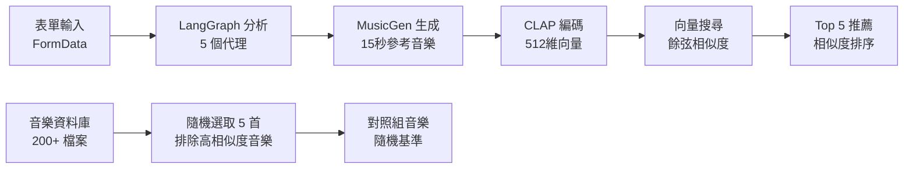

#### 3. A/B 測試配對設計 (已實現)

**實際配對策略** - `src/service/experiment_service.py`
- **測試組**: Top 5 推薦音樂 (基於 AI 分析)
- **對照組**: 5 首隨機音樂 (排除與推薦音樂高相似度的檔案)
- **配對方式**: 1對1 隨機配對，共 5 輪測試
- **呈現順序**: 隨機化 A/B 位置，避免位置偏誤
- **盲測保證**: 不顯示音樂來源、標題或任何識別資訊

#### 4. 盲測實驗界面 (已實現)

**實際界面實現** - `frontend/src/components/ABTestInterface.tsx`

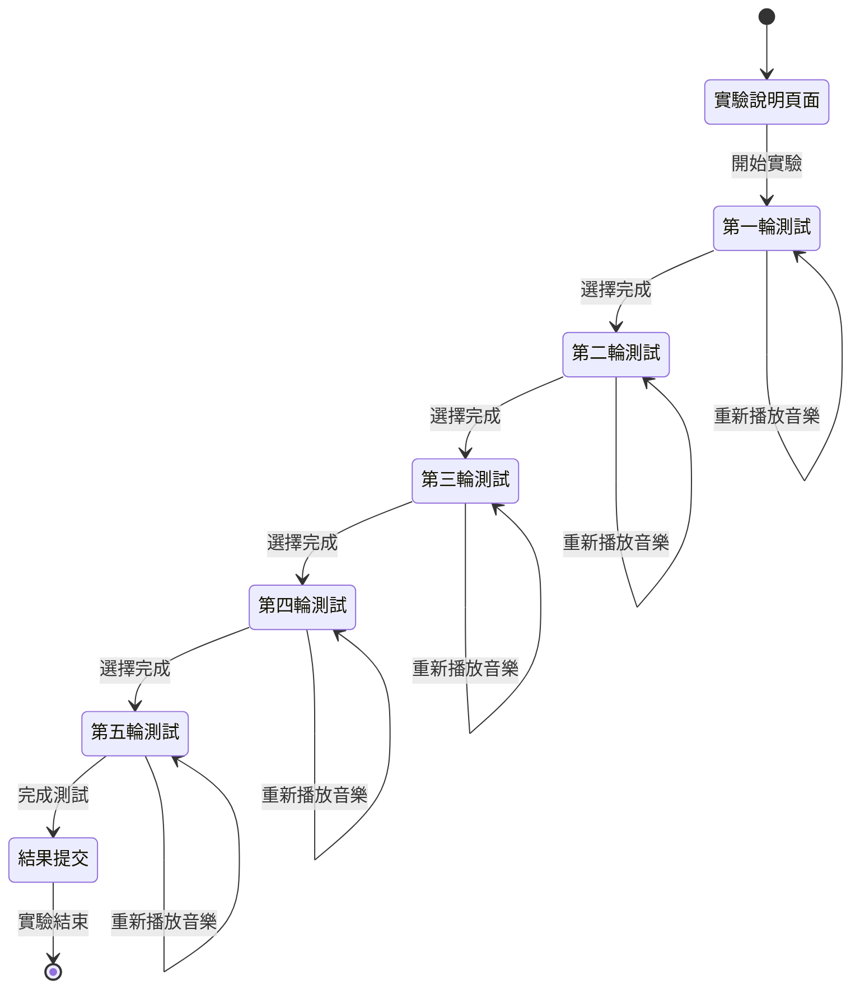

**實際界面功能**
- **盲測保證**: ✅ 完全不顯示音樂來源、標題或任何識別資訊
- **播放控制**: ✅ Web Audio API 實現，支援播放/暫停/重播
- **選擇記錄**: ✅ 清楚的 A/B 選項，Radio Button 設計
- **進度顯示**: ✅ 進度條顯示測試進度（1/5, 2/5...）
- **時間記錄**: ✅ 精確記錄每輪選擇的決策時間 (毫秒級)
- **播放統計**: ✅ 記錄每首音樂的播放次數和總聆聽時間
- **音頻載入**: ✅ 自動載入音頻檔案，支援多種格式
- **錯誤處理**: ✅ 完整的錯誤處理和用戶提示

#### 5. 數據記錄規格 (已實現)

**實際用戶選擇數據** - `frontend/src/types/api.ts`
```typescript
interface ABTestChoice {
  pair_id: string;                    // 配對唯一識別碼
  chosen_track: 'A' | 'B';           // 用戶選擇結果
  decision_time_ms: number;          // 決策時間 (毫秒)
  play_count_a: number;              // 音樂 A 播放次數
  play_count_b: number;              // 音樂 B 播放次數
  total_listen_time_a: number;       // 音樂 A 總聆聽時間
  total_listen_time_b: number;       // 音樂 B 總聆聽時間
}
```

**實際音樂配對數據**
```typescript
interface ABTestPair {
  id: string;                        // 配對唯一識別碼
  track_a: MusicTrack;              // 音樂 A (推薦或隨機)
  track_b: MusicTrack;              // 音樂 B (推薦或隨機)
  recommended_track: 'A' | 'B';     // 哪一個是推薦音樂
  similarity_score?: number;         // 推薦音樂的相似度分數
}
```

**實際儲存位置**: `backend/data/experiments/` 目錄
**檔案格式**: JSON 格式，包含完整實驗會話數據
**數據完整性**: 包含用戶表單、推薦結果、配對資訊、選擇記錄

### 實驗評估指標 (已實現)

#### 實際評估指標實現

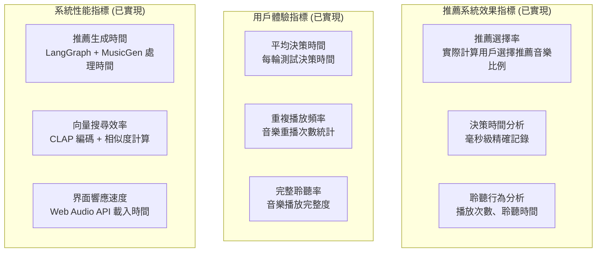

**實際計算實現** - `src/api/experiment.py`
- **推薦選擇率**: 統計 `chosen_track` 為推薦音樂的比例
- **決策時間分析**: 分析 `decision_time_ms` 分布
- **聆聽行為**: 分析 `play_count` 和 `total_listen_time` 模式

#### 實際統計分析支援

**API 端點**: `/api/experiment/analyze`
**支援功能**:
- 實驗會話統計分析
- 用戶行為模式分析
- 推薦效果評估報告
- 數據匯出功能

**假設檢驗框架** (可擴展):
- H0: 推薦系統效果與隨機選擇無差異
- H1: 推薦系統顯著優於隨機選擇
- 數據基礎: 實際用戶選擇記錄

**實驗數據完整性**:
- ✅ 用戶表單數據
- ✅ 推薦生成過程
- ✅ A/B 測試配對
- ✅ 用戶選擇行為
- ✅ 時間戳記錄

## 實際數據流設計

### 已實現的數據管線

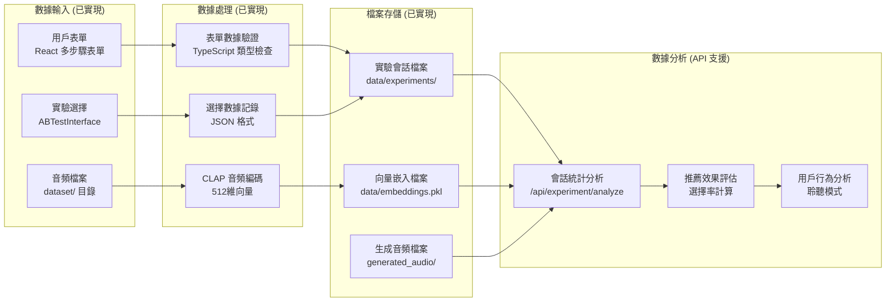

### 實際數據結構實現

**實驗會話數據** - `ABTestSession`
```typescript
{
  session_id: string;              // UUID 會話識別碼
  user_id: string;                 // 用戶識別碼 (基於 email)
  form_data: FormData;             // 完整表單數據
  test_pairs: ABTestPair[];        // 5 組 A/B 測試配對
  start_time: string;              // ISO 時間戳
  recommendation_metadata: {       // 推薦生成元數據
    recommendations_count: number;
    generation_time_ms: number;
  }
}
```

**用戶選擇數據** - `ABTestResult`
```typescript
{
  session_id: string;              // 關聯會話
  choices: ABTestChoice[];         // 5 次選擇記錄
  completion_time: string;         // 完成時間
  total_duration_ms: number;       // 總實驗時長
}
```

**檔案存儲位置**:
- 實驗數據: `backend/data/experiments/session_{uuid}.json`
- 向量數據: `backend/data/embeddings.pkl`
- 音頻檔案: `backend/dataset/` (原始) + `backend/generated_audio/` (生成)

## 實際系統開發架構

### 已實現的技術棧

**後端架構** (已實現)
- **框架**: ✅ Flask + Flask-RESTful + CORS 支援
- **AI 模型**: ✅ Transformers Library
    - `facebook/musicgen-small` (實際使用，非 large)
    - `laion/clap-htsat-unfused`
    - OpenAI GPT-4o-mini 或 Google Gemini-2.0-flash
- **工作流程**: ✅ LangGraph (5 個專業代理)
- **數據存儲**: ✅ 本地檔案系統 (JSON + Pickle)
- **API 文檔**: ✅ Swagger/OpenAPI 自動生成

**前端架構** (已實現)
- **框架**: ✅ React 19 + TypeScript
- **建置工具**: ✅ Vite 7 (非 SWC，使用預設)
- **音頻播放**: ✅ Web Audio API (完整實現)
- **UI 組件**: ✅ Ant Design 5
- **路由**: ✅ React Router DOM 7
- **HTTP 客戶端**: ✅ Axios

**開發工具** (已實現)
- **版本控制**: ✅ Git
- **依賴管理**: ✅ uv (Python) / npm (JavaScript)
- **測試框架**: ✅ pytest (後端) / 前端測試待實現
- **代碼品質**: ✅ ESLint + TypeScript 嚴格模式

### 實際模組化實現

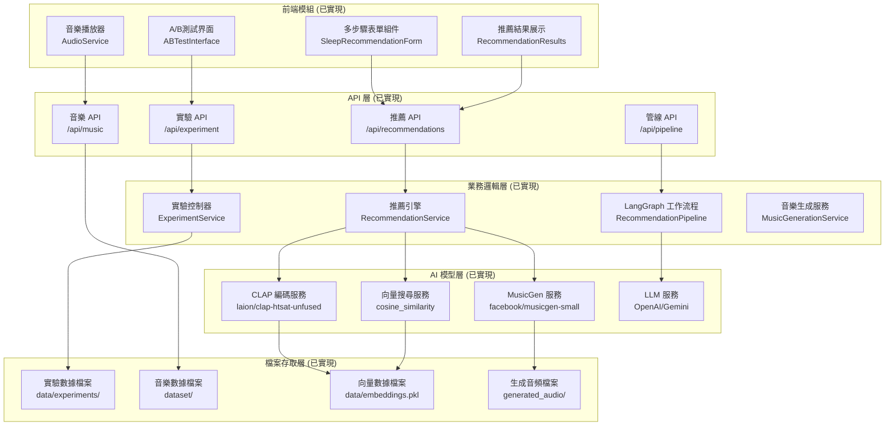

### 實際檔案結構

**後端結構** (`backend/src/`)
```
src/
├── api/              # Flask API 端點 (已實現)
├── nodes/            # LangGraph 代理節點 (已實現)
├── pipeline/         # LangGraph 管線 (已實現)
├── service/          # 業務邏輯服務 (已實現)
├── state/            # 狀態管理 (已實現)
└── utils/            # 工具函數 (已實現)
```

**前端結構** (`frontend/src/`)
```
src/
├── components/       # React 組件 (已實現)
├── pages/           # 頁面組件 (已實現)
├── services/        # API 和音頻服務 (已實現)
├── types/           # TypeScript 類型定義 (已實現)
└── utils/           # 工具函數 (已實現)
```
