# Symphony AI 推薦系統設計文件

## 概述

本文件描述了 Symphony AI 睡眠音樂推薦系統的核心架構設計與實驗評估流程。系統採用多代理工作流程，結合大型語言模型、音樂生成技術和向量相似度搜尋，為用戶提供個性化的睡眠音樂推薦。本系統同時設計了嚴謹的 A/B 測試實驗流程，用於驗證推薦系統的有效性。

## 系統目標

### 主要目標
- **個性化推薦**: 基於用戶生理心理狀態提供客製化音樂推薦
- **智能音樂生成**: 利用 AI 技術動態生成符合需求的睡眠音樂
- **科學驗證**: 通過嚴謹的實驗設計驗證推薦系統效果
- **用戶體驗優化**: 提供直觀易用的推薦服務界面

### 技術目標
- **推薦準確性**: 實現高品質的音樂語義匹配
- **系統響應性**: 保持良好的用戶互動體驗
- **實驗可重複性**: 建立標準化的評估流程
- **數據收集完整性**: 全面記錄用戶行為和偏好數據

## 系統架構

### 整體流程圖

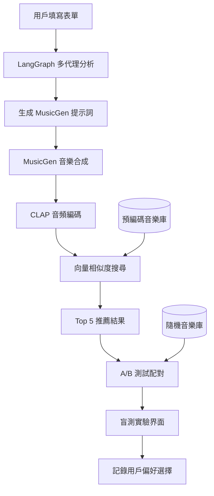

### 系統組件架構

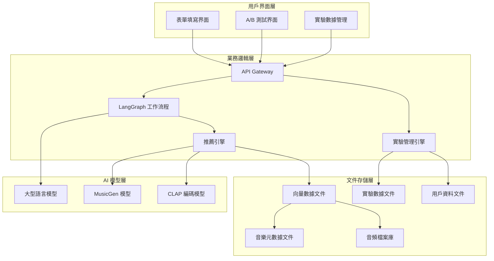

## 推薦系統核心組件

### 1. LangGraph 多代理工作流程

#### 1.1 代理架構設計

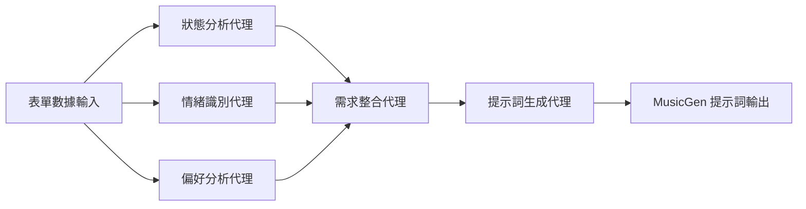

#### 1.2 代理職責分工

**狀態分析代理 (State Analysis Agent)**
- **輸入數據**: 壓力指數、身體感受、情緒狀態
- **分析功能**: 評估用戶當前生理心理狀態
- **輸出結果**: 狀態摘要和緊急程度評估

**情緒識別代理 (Emotion Recognition Agent)**
- **輸入數據**: 情緒狀態、入睡目標
- **分析功能**: 識別主導情緒和情緒調節需求
- **輸出結果**: 情緒標籤和調節策略

**偏好分析代理 (Preference Analysis Agent)**
- **輸入數據**: 聲音偏好、節奏偏好、敏感度設定
- **分析功能**: 分析用戶音樂偏好和限制條件
- **輸出結果**: 偏好矩陣和禁忌列表

**需求整合代理 (Requirement Integration Agent)**
- **輸入數據**: 各代理的分析結果
- **整合功能**: 統合所有需求，解決衝突
- **輸出結果**: 統一的需求規格

**提示詞生成代理 (Prompt Generation Agent)**
- **輸入數據**: 整合需求規格
- **生成功能**: 產生結構化的 MusicGen 提示詞
- **輸出結果**: 最佳化的音樂生成指令

### 2. MusicGen 音樂合成模組

#### 2.1 提示詞結構設計

**基本結構組件**
- **音樂類型** (Genre): lo-fi, ambient, classical, electronic
- **節奏速度** (Tempo): very slow, slow, moderate, rhythmless
- **情緒氛圍** (Mood): calming, soothing, peaceful, relaxing
- **樂器選擇** (Instruments): piano, guitar, strings, synthesizer
- **音樂特徵** (Characteristics): soft, gentle, melodic, harmonic
- **頻率調諧** (Frequency): 432Hz, standard tuning
- **音樂長度** (Duration): 30-120 seconds

#### 2.2 提示詞生成策略

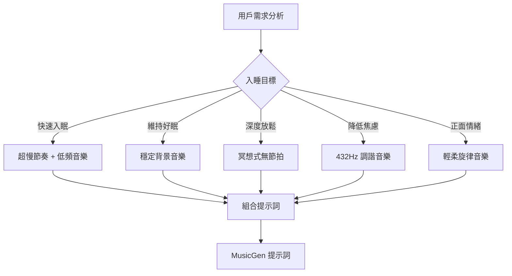

### 3. CLAP 音頻編碼與向量搜尋

#### 3.1 音頻處理流程

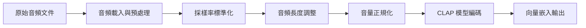

#### 3.2 相似度搜尋流程

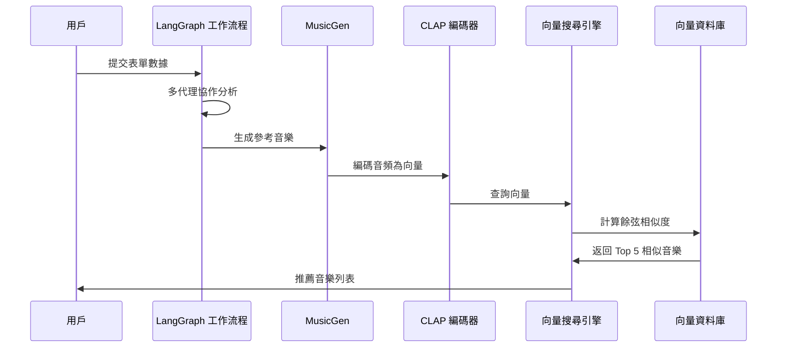

### 4. 推薦引擎邏輯

#### 4.1 推薦策略設計

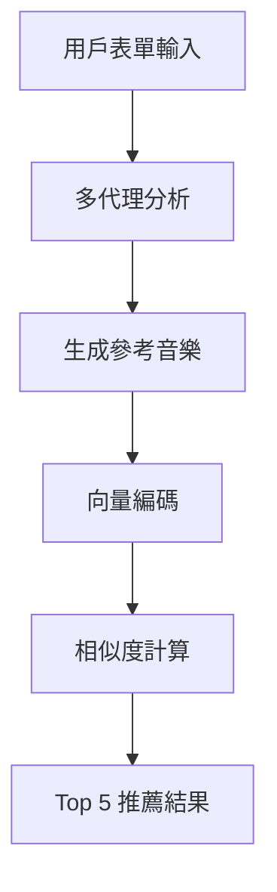

#### 4.2 排序算法設計

**綜合評分因子**
- **向量相似度**: 主要排序依據
- **用戶偏好匹配**: 聲音類型、節奏偏好符合度
- **音樂品質評估**: 音頻質量和完整性

## A/B 測試實驗設計

### 實驗流程架構

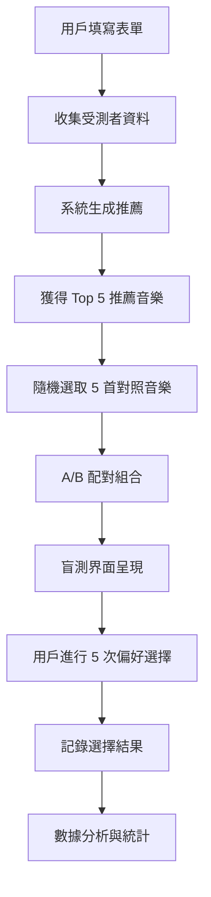

### 實驗設計詳細說明

#### 1. 數據收集階段

**受測者資料收集**
- 基本人口統計學資料
- 睡眠習慣問卷
- 音樂偏好背景
- 參與實驗同意書

**表單數據結構化**
- 生理心理狀態評估
- 音樂偏好設定
- 入睡目標定義
- 敏感度設定記錄

#### 2. 推薦生成階段

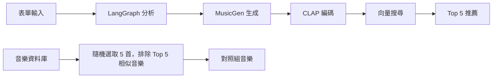

#### 3. A/B 測試配對設計

**配對策略**
- **測試組**: Top 5 推薦音樂
- **對照組**: 5 首隨機音樂（排除與 Top 5 高相似度的音樂）
- **配對方式**: 1對1 隨機配對，共 5 輪測試
- **呈現順序**: 隨機化 A/B 位置避免位置偏誤

#### 4. 盲測實驗界面

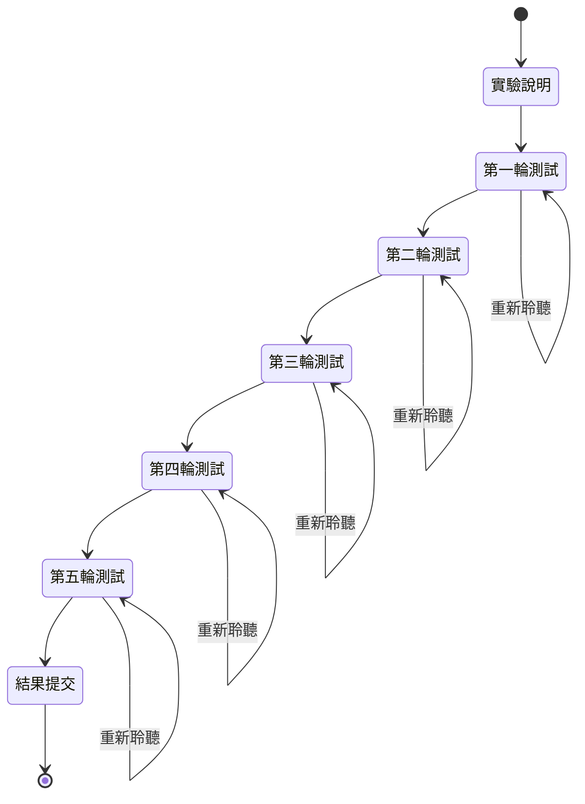

**界面設計要求**
- **盲測保證**: 不顯示音樂來源和類型資訊
- **播放控制**: 支援重複播放和暫停功能
- **選擇記錄**: 清楚標示 A/B 選項
- **進度顯示**: 明確顯示測試進度（1/5, 2/5...）
- **時間記錄**: 記錄每輪選擇的思考時間

#### 5. 數據記錄規格

**用戶選擇數據**
- 每輪測試的選擇結果（A 或 B）
- 選擇決策時間
- 音樂播放時長
- 重複播放次數

**音樂配對數據**
- 推薦音樂與對照音樂的配對關係
- 音樂的向量相似度分數
- 音樂的元數據資訊
- A/B 位置隨機化記錄

### 實驗評估指標

#### 主要評估指標

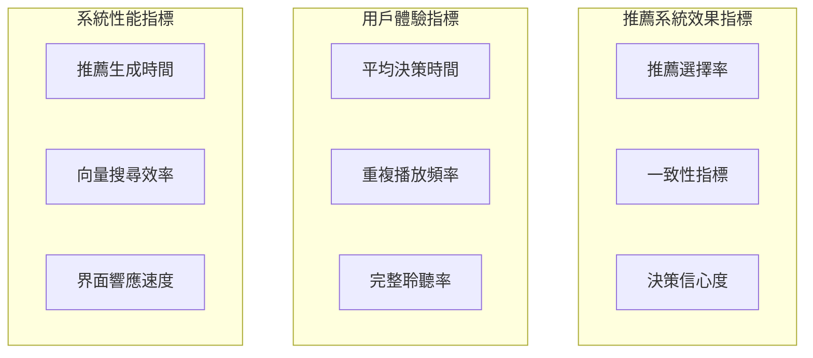

**計算方式**
- **推薦選擇率**: 用戶選擇推薦音樂的比例 (0-100%)
- **一致性指標**: 同類型用戶偏好的一致性程度
- **決策信心度**: 基於決策時間和重複播放行為的信心評估

#### 統計分析方法

**假設檢驗**
- H0: 推薦系統效果與隨機選擇無差異
- H1: 推薦系統顯著優於隨機選擇
- 統計檢驗: 卡方檢驗、t 檢驗

**效果量評估**
- Cohen's d: 評估推薦效果的實際意義
- 95% 信賴區間: 估計真實效果範圍

## 數據流設計

### 實驗數據管線

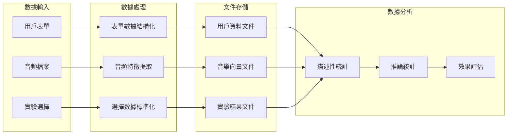

### 實驗數據結構

**用戶檔案數據**
- 用戶唯一識別碼
- 人口統計學資料
- 音樂背景調查
- 睡眠習慣資訊

**實驗會話數據**
- 會話唯一識別碼
- 表單填寫時間戳
- 推薦生成結果
- A/B 測試配對記錄

**偏好選擇數據**
- 每輪測試結果
- 決策時間記錄
- 音樂播放行為
- 用戶反饋意見

## 系統開發架構

### 技術棧選擇

**後端架構**
- **框架**: Flask + Flask-RESTful
- **AI 模型**: Transformers Library (MusicGen, CLAP)
    - `facebook/musicgen-large`
    - `laion/clap-htsat-unfused`
- **工作流程**: LangGraph
- **數據存儲**: 本地檔案系統（JSON 文件暫存）
- **檔案存儲**: 本地檔案系統

**前端架構**
- **框架**: React + TypeScript
- **建置工具**: Vite + SWC
- **音頻播放**: Web Audio API
- **UI 組件**: Ant Design
- **狀態管理**: React Context / Redux (可選)

**開發工具**
- **版本控制**: Git
- **容器化**: Docker
- **依賴管理**: uv (Python) / npm (JavaScript)
- **測試框架**: pytest / Jest

### 模組化設計

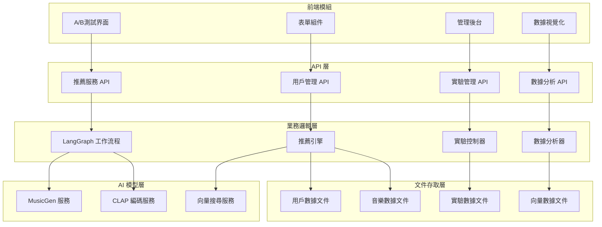
